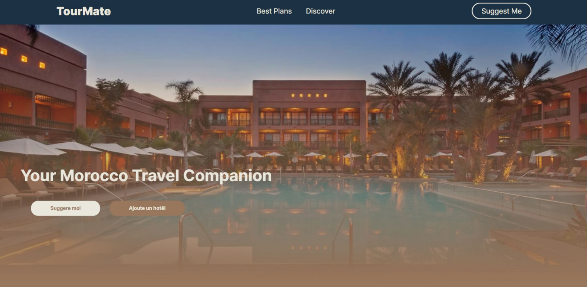

<h1 align="center">🚀 TourMate</h1>

TourMate is a personalized hotel recommendation system designed to enhance the travel experience of tourists visiting Morocco. 🌍🏨

  
  
  

  

  

## 🧰 Dependencies
- Flask 🌐
- numpy 🧮
- sqlite3 🗄️
- pandas 🐼
- NLTK (Natural Language Toolkit) 📚

## 🚀 Usage

1. Clone or download the repository.
2. Install the required dependencies: `pip install -r requirements.txt`
3. Run the Flask app using `python -m flask`.
4. Access the TourMate application through the provided routes. Interact with the user interface to navigate and view different sections.

## 📦 TourMate Files:

- **helpers.py:**

        This file contains the necessary data processing and recommendation logic for the hotel recommendation feature in the Flask app.

    #### Importing modules
        - numpy 🧮
        - sqlite3 🗄️
        - pandas 🐼
        - NLTK (Natural Language Toolkit) 📚

    #### Database connection

        Establishing a connection to the SQLite database "tourmate.db" and retrieving the contents of the "hotels" table into a pandas DataFrame named "df".

    #### Data cleaning

        Performing data cleaning operations on "df" by:
        - Dropping records with empty "address" values ❌
        - Removing duplicates based on the "name" column 🗑️

    #### City extraction

        Defining a function called "format_ville" that extracts the city name from the address. A predefined list of cities is used to find a match in the address, and the extracted city is added as a new column "city" in the DataFrame "df".

    #### Language extraction

        Defining a function called "format_langue" that extracts languages from a given string and adds them as a new column "languages" in "df".

    #### Recommendation system

        Computing the average number of reviewers for all hotels "C", the minimum number of reviewers for credibility "m", and the prior average rating for all hotels "prior_avg". Then, calculating the Bayesian average rating for each hotel using the formula: "bay_avg = (m * prior_avg + nbr_reviews * rating) / (m + C)". The result is stored in a new column "bayesian_avg" in "df".

    #### Recommendation function

        Defining a function named "recommendation" that takes parameters such as city, language, preference, price, and additional search options. This function filters and sorts the DataFrame "df" based on the provided parameters to generate a list of recommended hotels. 🏨
    
- **app.py:**

        This file utilizes the Flask framework and includes various routes to handle different functionalities.

    #### Importing modules

        Importing the following modules:
        - Flask 🌐
        - redirect, render_template, request, and flash 📄
        - Functions "VillesListe," "LanguesListe," and "recommendation" from the "helpers" module.

    #### Routes

        - "/" route: Renders the "index.html" template for a GET request. For a POST request, checks the form action submitted by the user. If it is "Ajoute un hôtel," redirects to the "/encours" route. Otherwise, redirects to the "/suggestion" route.

        - "/suggestion" route: For a POST request, retrieves form data and assigns the values to variables. Calls the "recommendation" function with the provided parameters. Processes the results and converts them into a formatted output string. If no results are found, displays a flash message. Finally, renders the "suggestion.html" template, passing lists of cities and languages, as well as the formatted result.

        - "/encours" route: Renders the "encours.html" page, indicating that the section is under development. 🚧
  
- **Templates:**

        - layout.html: Defines the pattern for each page, including a navbar, a body, and a footer.
        
        - index.html: Contains a call-to-action button to access the service.

        - suggestion.html: Enables users to input criteria for hotel recommendations, including city, language, maximum price, and preferences for room types, features, and amenities. After submitting the form, a list of hotel results is displayed, showcasing details such as name, rating,
        location, price, languages spoken, room types, and amenities. Users can also access the hotel's location on Google Maps.

        - encours.html: Displays "En cours de réalisation" (Under construction).

- **Static:**

        - Pictures: Pictures used on the homepage.

        - JavaScript file: JS file to handle the navbar on mobile and the buttons on each hotel card.

        - CSS: The CSS document defines styling rules for the web pages. It sets the box-sizing, margin, and padding properties to standardize element sizing. It defines background color, font styles, and colors for various sections like the header, navigation links, call-to-action buttons, hero section, and footer. The document also includes media queries to adjust the layout for different screen sizes, hiding certain elements, and modifying their styles.

## 🌟 Future Prospects

For future prospects, we plan to expand the platform by incorporating the following functionalities:
- Hosting the web application 🌐
- Enabling real-time usage ⚡

We hope that our project will be useful for tourists who wish to explore the beautiful country of Morocco and find great accommodation deals. 🌟🇲🇦

## Show your support

Give a ⭐️ if this project helped you! 🌟